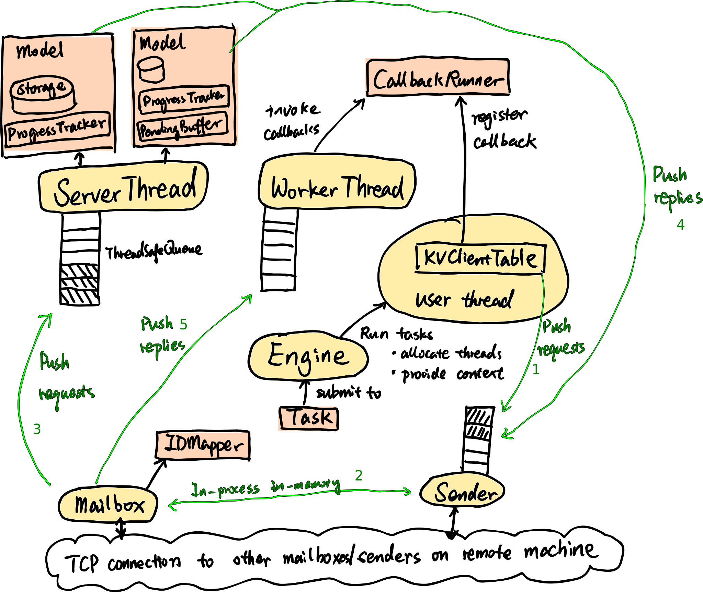

# CSCI5570 Parameter Server Project Demonstration

In courtesy of the Husky team. Special thanks to Yuzhen Huang. This repo serves as a demo for the course project. Please do not be limited to it and feel free to use or modify the codes to suit your own design. You may also choose a completely different design.

## Install & Run
Git clone this repository by
```sh
git clone https://github.com/TatianaJin/csci5570.git
cd csci5570
```
Create a directory for putting compiled files, and configure cmake.
```
mkdir build && cd build
cmake .. -DCMAKE_BUILD_TYPE=Debug
```
See the make list by `make help`, and make anything in the list by `make ${ANYTHING}`

```
cd build/     # cd to the build directory
make -j4      # build all the targets
./HuskyUnitTest  # run all unit tests
./HuskyUnitTest --gtest_filter=TestServerThread.RegisterModel  # run a specific test
```
### Some tools: 
* [glog](http://rpg.ifi.uzh.ch/docs/glog.html). You may use `GLOG_logtostderr=1 ./HuskyUnitTest` to print the `LOG(INFO)` information to the console.
* [gtest](https://github.com/google/googletest/blob/master/googletest/docs/Primer.md).
* Actor model
* cmake
* C++ (C++11, multi-threading, std::move, rvalue reference, classes...)

## Overview



Below are the milestones for each week. 

## Milestone 1: Get familiar with the communication module and actor abstraction
* The mailbox is provided as a bottom layer communication module
* The prototypes of server threads, worker threads, and communication threads are also provided for your reference
* There are some utility files for compilation and testing for your reference

## Milestone 2: Create server threads and their model storage
* Check the overall picture about the worker and server in `test/test_worker.cpp` and `test/test_server.cpp`.
* Understand how the modules on the server side work together.
* Implement `server_thread.cpp` according to the information given in `server_thread_test.cpp`.
* Implement `map_storage.hpp` according to the information given in `map_storage_test.cpp`.

## Milestone 3: Distribute the model to servers
* Check `base/abstract_partition_manager.hpp` and implement your parititoning strategies
* You should have tried implementing MapStorage in the previous milestone. You may try other storage method such as using vector.
* Write a small program to link the paritition manager with the storages and to initialize storages associated with different server threads

## Milestone 4: Now the workers come into play
* Check `worker/kv_client_table_test.cpp`. Understand how `AbstractCallbackRunner` and `AbstractPartitionManager` functions and how the modules on the worker side work together
* Understand how model parameters are rendered to users in the process from mailbox receiving messages, to worker threads invoking callbacks, and finally to KVClientTable returning with completed requests
* Implement a callback runner to handle reply messages
* Implement [KVClientTable](worker/kv_client_table.hpp) according to the information given in `worker/kv_client_table_test.cpp`

## Milestone 5: Feed the training data
* Check the io folder and understand how to connect to HDFS and coordinate data loading among workers
* Take a look at test/test_hdfs_read.cpp and see how the connector may be used to load data
* Check the lib folder for the abstraction of data loaders and labeled sample
* Implement the data loaders and parsers. Understanding the producer-consumer paradigm may help

## Milestone 6: Orders are to be established
* Check the tests for the three consistency models and understand the expected behaviors
* Check the pending buffer and progress tracker interface
* Implement ASP, BSP, and SSP models

## Milestone 7: Put together and run
* Check the tests and complete engine.cpp, info.hpp, simple_id_mapper.cpp, and worker_spec.cpp
* Write a script to launch the system on the cluster

### Hints for the driver part
Here I highlight some hints for the driver of the user program

#### Worker threads in Engine, SimpleIdMapper, Info
There are two kinds of worker threads:
1. User worker thread (spawned in `Engine::Run`, corresponding to `SimpleIdMapper::node2worker_` and user thread in the mind map). User worker threads run the UDF specified in tasks, i.e. carry out the main computation. The `worker_id` and `thread_id` of each user worker thread is allocated via `Engine::AllocateWorkers` and can be fetched from the returned `WorkerSpec` instance. The `worker_id` and `thread_id` should be put into an `Info` instance and passed to the UDF.
2. Worker helper thread (corresponding to `Engine::worker_thread_`, `SimpleIdMapper::kWorkerHelperThreadId`, `SimpleIdMapper::node2worker_helper_`, and WorkerThread in the mind map). This thread is responsible to invoke the callbacks registered by `KVClientTable` through an `AbstractCallbackRunner` instance. Namely, this thread works in the background to help handle the reponses to the get requests issued by the user worker threads. Please notice that the `AbstractCallbackRunner` should contain the callbacks for each `KVClientTable` instance owned by the user workers. Do not just copy the `FakeCallbackRunner` I implemented in the test files, which has only two callbacks.

#### The constants in SimpleIdMapper
There are four constants: `kMaxNodeId`, `kMaxThreadsPerNode`, `kMaxBgThreadsPerNode`, and `kWorkerHelperThreadId`.
1. The id range for each node i is [i * `kMaxThreadsPerNode`, (i+1) * `kMaxThreadsPerNode`).
2. The server threads use the range [i * `kMaxThreadsPerNode`, i * `kMaxThreadsPerNode` + `kWorkerHelperThreadId`), and server ids are allocated using `SimpleIdMapper::Init`.
3. The worker threads (in the background, also referred as worker helper threads) use the range [i * `kMaxThreadsPerNode` + `kWorkerHelperThreadId`, i * `kMaxThreadsPerNode` + `kMaxBgThreadsPerNode`), also allocated using `SimpleIdMapper::Init`.
4. The user worker threads created when running the task use the range [i * `kMaxThreadsPerNode` + `kMaxBgThreadsPerNode`, i * `kMaxThreadsPerNode` + `kMaxThreadsPerNode`). The user worker ids are manipulated by `SimpleIdMapper::AllocateWorkerThread` and `SimpleIdMapper::DeallocateWorkerThread`.
# csci5570proj
